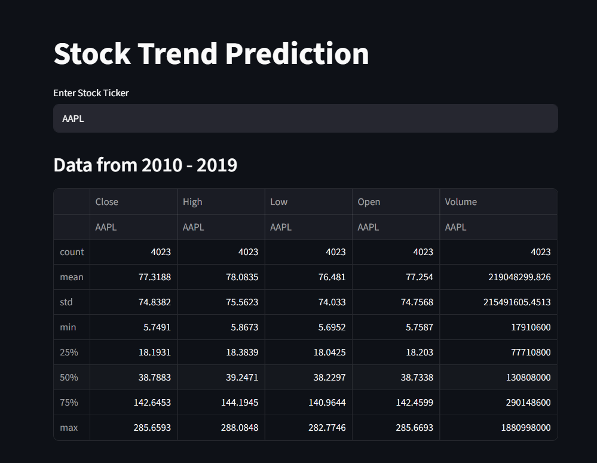
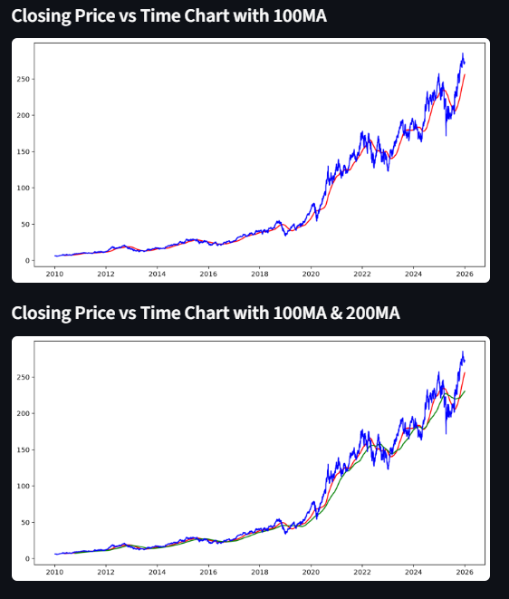
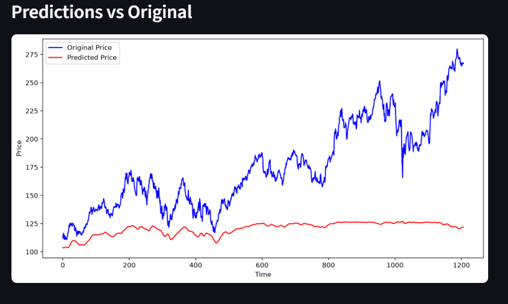

# 📈 Stock Trend Prediction Web App

A machine learning-powered Stock Trend Prediction Web Application built using **Python, Streamlit, TensorFlow, and Yahoo Finance API**. The application allows users to enter any stock ticker symbol and visualize historical stock trends, moving averages, and LSTM-based price predictions.

## 🚀 Features

* Interactive web interface using Streamlit
* Real-time stock data fetching using Yahoo Finance
* Historical stock price visualization
* 100-Day Moving Average Analysis
* 100-Day & 200-Day Moving Average Comparison
* LSTM-based stock price prediction
* Supports multiple stock tickers (AAPL, TSLA, MSFT, NVDA, RELIANCE.NS, TCS.NS, etc.)
* Responsive and easy-to-use dashboard

## 🛠️ Tech Stack

### Frontend

* Streamlit

### Backend

* Python

### Machine Learning

* TensorFlow
* Keras
* LSTM (Long Short-Term Memory)

### Data Processing

* NumPy
* Pandas
* Scikit-learn

### Visualization

* Matplotlib

### Data Source

* Yahoo Finance (yfinance)

## 📂 Project Structure

```text
Stock-Trend-Prediction/
│
├── app.py
├── keras_model.h5
├── requirements.txt
├── Untitled.ipynb
└── README.md
```

## 📊 Workflow

1. User enters a stock ticker symbol.
2. Historical stock data is fetched from Yahoo Finance.
3. Data is visualized using line charts and moving averages.
4. Data is preprocessed using MinMaxScaler.
5. A pre-trained LSTM model predicts future stock trends.
6. Predicted prices are compared against actual prices.

## ⚙️ Installation

Clone the repository:

```bash
git clone https://github.com/Anushka-dev707/Stock-Trend-Prediction.git
cd Stock-Trend-Prediction
```

Create and activate a virtual environment:

```bash
conda create -n stockenv python=3.11
conda activate stockenv
```

Install dependencies:

```bash
pip install -r requirements.txt
```

Run the application:

```bash
streamlit run app.py
```

## 📈 Example Tickers

### US Stocks

* AAPL
* MSFT
* NVDA
* TSLA
* GOOGL
* AMZN

### Indian Stocks

* RELIANCE.NS
* TCS.NS
* INFY.NS
* HDFCBANK.NS
* ICICIBANK.NS

### Indices

* ^NSEI (NIFTY 50)
* ^BSESN (SENSEX)
* ^GSPC (S&P 500)

## 📸 Screenshots

## Screenshots

### Home Page



### Moving Average Analysis



### Prediction vs Actual Price




## 👩‍💻 Author

**Anushka Goyal**

B.Tech – Artificial Intelligence & Data Science
Indira Gandhi Delhi Technical University for Women (IGDTUW)

GitHub: https://github.com/Anushka-dev707

## ⭐ If you found this project useful, consider giving it a star!
